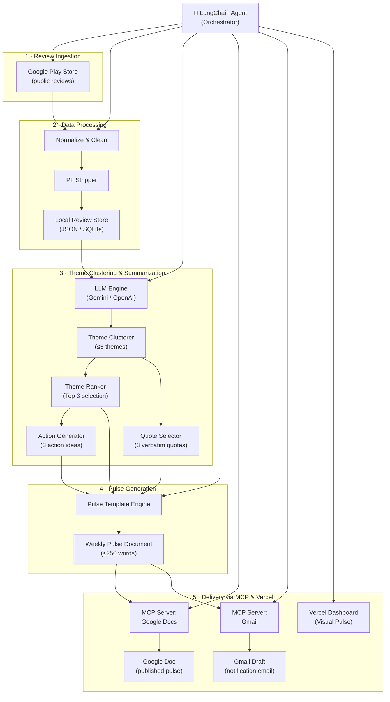
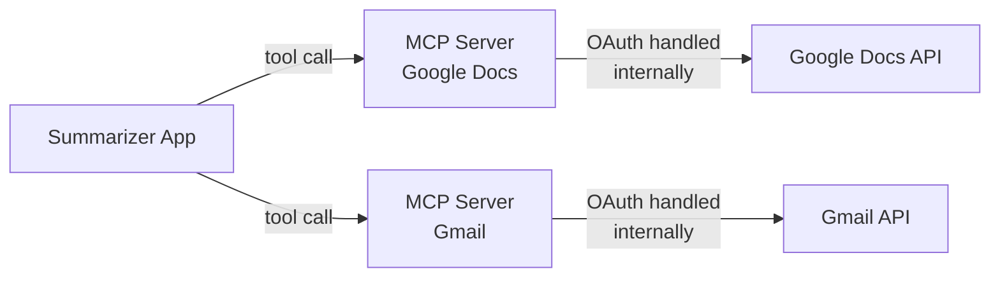
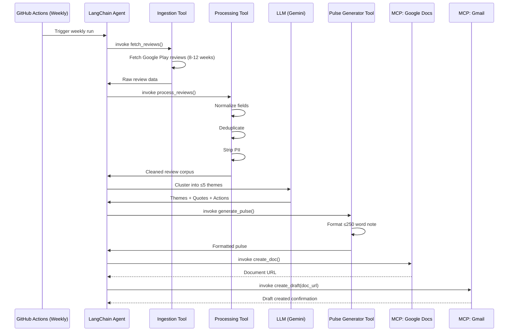

# Architecture: AI Reviews Summarizer for Noon

## 1. System Overview

The AI Reviews Summarizer is a **LangChain-powered AI agent** that ingests public Google Play Store reviews for the **Noon Buyer App**, clusters them into themes using an LLM, generates a concise weekly pulse document, and delivers it via Google Docs and Gmail—all orchestrated through MCP (Model Context Protocol) servers.

```
                              ┌──────────────────────────────────────────────────────┐
                              │          LangChain Agent (Orchestrator)              │
                              └──────────────┬───────────────────────────────────────┘
                                             │
┌─────────────┐     ┌──────────────┐     ┌───▼──────────┐     ┌────────────┐     ┌────────────┐
│  Review      │────▶│  Data        │────▶│  Theme       │────▶│  Pulse     │────▶│  Delivery  │
│  Ingestion   │     │  Processing  │     │  Clustering  │     │  Generator │     │  (MCP)     │
└─────────────┘     └──────────────┘     └──────────────┘     └────────────┘     └────────────┘
  Google Play         Clean, filter,       LLM-based            Weekly note        Google Docs
  (public data)       normalize,           clustering            ≤250 words         Gmail Draft
                      PII strip            (≤5 themes)           Top 3 themes       Vercel UI
```

---

## 2. High-Level Architecture Diagram



---

## 3. Module Breakdown

### 3.1 Review Ingestion Module

**Purpose:** Fetch public reviews for the Noon Buyer App from Google Play Store.

| Concern | Detail |
| :--- | :--- |
| **Google Play** | Use the [`google-play-scraper`](https://pypi.org/project/google-play-scraper/) Python package to fetch public reviews. App ID: `com.noon.buyerapp`. |
| **Time Window** | Fetch reviews from the last 8–12 weeks. Filter by date during ingestion. |
| **Fields Captured** | `rating`, `title`, `text`, `date`, `source` (google_play), `reviewId` |
| **Compliance** | Public data only. No store logins, no ToS-violating automation. |

**Output:** Raw review records saved to local storage.

```
data/
├── raw/
│   └── google_play_reviews.json
└── processed/
    └── cleaned_reviews.json
```

---

### 3.2 Data Processing Module

**Purpose:** Clean, normalize, and strip PII from raw reviews before analysis.

#### Pipeline Steps:
1. **Normalization** — Standardize fields into a unified schema.
2. **Deduplication** — Remove duplicate reviews (same text + date).
3. **PII Stripping** — Remove usernames, email addresses, device IDs, phone numbers, and any other identifiable data using regex patterns and LLM-assisted redaction.
4. **Date Filtering** — Ensure only reviews within the target window (8–12 weeks) are retained.

#### Unified Review Schema:
```json
{
  "id": "string (hashed internal ID)",
  "source": "google_play",
  "rating": 1-5,
  "title": "string | null",
  "text": "string",
  "date": "ISO 8601 date string",
  "language": "en"
}
```

---

### 3.3 Theme Clustering Module

**Purpose:** Group cleaned reviews into a maximum of **5 themes** using LLM-based clustering.

#### Approach:
- **LLM-Driven Clustering:** Send batches of review text to the LLM with a structured prompt instructing it to identify up to 5 recurring themes from the corpus.
- **Theme Assignment:** Each review is assigned to exactly one theme. The LLM returns a mapping of `reviewId → theme`.
- **Theme Ranking:** Themes are ranked by review count (volume) and average sentiment. The **top 3** are selected for the pulse.

#### Example Themes:
| Theme | Description |
| :--- | :--- |
| Payments & Checkout | Issues with payment methods, failed transactions, checkout flow |
| Delivery & Tracking | Late deliveries, tracking inaccuracies, courier complaints |
| App Performance | Crashes, slow loading, UI bugs |
| Customer Support | Response times, resolution quality, chatbot frustrations |
| Pricing & Promotions | Coupon issues, price mismatches, flash sale problems |

#### Quote Selection:
- For each of the top 3 themes, select **1 representative verbatim quote** that best captures user sentiment (3 total).
- Quotes are chosen based on: clarity, specificity, and recency.
- All quotes are verified to be PII-free.

#### Action Generation:
- For each of the top 3 themes, generate **1 concrete, actionable recommendation** grounded in the review data (3 total).

---

### 3.4 Pulse Generation Module

**Purpose:** Assemble the weekly one-page pulse note (≤250 words).

#### Pulse Structure:
```markdown
# Noon App Pulse — Week of [DATE]

## 🔥 Top Themes This Week

### 1. [Theme Name] ([X] reviews)
> "[Verbatim user quote]"
💡 **Action:** [Concrete recommendation]

### 2. [Theme Name] ([X] reviews)
> "[Verbatim user quote]"
💡 **Action:** [Concrete recommendation]

### 3. [Theme Name] ([X] reviews)
> "[Verbatim user quote]"
💡 **Action:** [Concrete recommendation]

---
📊 Based on [N] reviews from [DATE_START] – [DATE_END]
⭐ Average rating: [X.X] / 5
```

#### Constraints Enforced:
- Total word count ≤ 250.
- Exactly 3 themes, 3 quotes, 3 actions.
- No PII anywhere in the output.

---

### 3.5 Delivery Module (MCP Integration)

**Purpose:** Publish the pulse to Google Docs and create a Gmail draft using MCP servers.

#### MCP Architecture:



#### Google Docs Delivery:
| Step | MCP Tool Call | Description |
| :--- | :--- | :--- |
| 1 | `docs.create` or `docs.update` | Create a new Google Doc (or update an existing weekly pulse doc) with the generated pulse content. |
| 2 | `docs.get_url` | Retrieve the shareable URL of the published document. |

#### Gmail Delivery:
| Step | MCP Tool Call | Description |
| :--- | :--- | :--- |
| 1 | `gmail.create_draft` | Create a draft email with the pulse content in the body and/or a link to the Google Doc. |
| 2 | — | The user reviews and sends the draft manually. |

#### Vercel Dashboard Delivery:
| Step | Action | Description |
| :--- | :--- | :--- |
| 1 | File write | The agent writes a `latest_pulse.json` to the `dashboard/data/` directory. |
| 2 | GitHub Actions | The CI/CD pipeline commits the new JSON payload to the repository. |
| 3 | Vercel Deploy | Vercel detects the commit and serves the updated HTML dashboard automatically. |

#### Why MCP (Not Direct API):
- **No OAuth client code** — MCP servers handle authentication internally.
- **No REST plumbing** — The app calls high-level MCP tools, not raw HTTP endpoints.
- **Consistency** — Aligned with the course tooling and agent-based architecture patterns.
- **Maintainability** — Auth token refresh, API versioning, and error handling are encapsulated in the MCP server.

---

## 4. Technology Stack

| Layer | Technology | Rationale |
| :--- | :--- | :--- |
| **Language** | Python 3.11+ | Rich ecosystem for data processing and LLM integration. |
| **Agent Framework** | LangChain + LangGraph | Agent orchestration, tool binding, chain composition, and stateful workflows. |
| **Review Scraping** | `google-play-scraper` (Python) | Lightweight, public-data-only library for Google Play reviews. |
| **LLM** | Google Gemini API (via `langchain-google-genai`) | Theme clustering, summarization, action generation. |
| **Data Storage** | JSON files (local) | Simple, no database overhead for a weekly batch job. |
| **PII Detection** | Regex + LLM-assisted redaction | Defense-in-depth: regex catches patterns, LLM catches contextual PII. |
| **Templating** | Jinja2 or Python f-strings | Pulse document formatting. |
| **MCP Client** | MCP SDK (Python) | Call Google Docs and Gmail MCP servers. |
| **Orchestration** | LangChain Agent + CLI entry-point | LangChain agent drives the pipeline; single `main.py` to launch. |
| **Scheduling** | GitHub Actions | Automate weekly runs (Sundays at 10 PM UAE time). |

---

## 5. Data Flow



---

## 6. Project Structure

```
AI reviews summarizer/
├── problemStatement.md          # Project requirements
├── problemstatement.txt         # Original problem statement
├── architecture.md              # This document
│
├── src/
│   ├── main.py                  # Entry point — launches the LangChain agent
│   ├── agent.py                 # LangChain agent definition (tools, chains, prompt)
│   ├── config.py                # Configuration (API keys, app IDs, time window, etc.)
│   │
│   ├── tools/                   # LangChain tools (each step is an agent tool)
│   │   ├── __init__.py
│   │   ├── fetch_reviews.py     # Google Play review fetcher tool
│   │   ├── process_reviews.py   # Normalize, deduplicate, strip PII tool
│   │   ├── cluster_themes.py    # LLM-based theme clustering tool (≤5 themes)
│   │   ├── generate_pulse.py    # Assemble the ≤250-word pulse note tool
│   │   ├── publish_doc.py       # MCP client tool for Google Docs
│   │   └── draft_email.py       # MCP client tool for Gmail
│   │
│   ├── chains/                  # LangChain chains for multi-step LLM workflows
│   │   ├── __init__.py
│   │   ├── theme_chain.py       # Chain: cluster → rank → quote select → actions
│   │   └── pulse_chain.py       # Chain: themes + quotes + actions → formatted pulse
│   │
│   ├── prompts/                 # LangChain prompt templates
│   │   ├── __init__.py
│   │   ├── clustering_prompt.py # Prompt for theme clustering
│   │   ├── action_prompt.py     # Prompt for action idea generation
│   │   └── pulse_prompt.py      # Prompt for pulse note assembly
│   │
│   ├── processing/
│   │   ├── __init__.py
│   │   ├── normalizer.py        # Schema normalization
│   │   ├── deduplicator.py      # Duplicate review removal
│   │   └── pii_stripper.py      # PII detection and redaction
│   │
│   └── delivery/
│       ├── __init__.py
│       ├── mcp_docs.py          # MCP client for Google Docs
│       └── mcp_gmail.py         # MCP client for Gmail
│
├── data/
│   ├── raw/                     # Raw review exports (auto-generated)
│   ├── processed/               # Cleaned review data (auto-generated)
│   └── pulses/                  # Generated pulse documents (archive)
│
├── dashboard/
│   ├── index.html               # Vercel frontend HTML
│   ├── css/style.css            # Vercel frontend styles
│   ├── js/app.js                # Vercel frontend logic
│   └── data/                    # JSON data synced by GitHub Actions
│
├── tests/
│   ├── test_tools.py
│   ├── test_chains.py
│   ├── test_processing.py
│   ├── test_pulse.py
│   └── test_delivery.py
│
├── requirements.txt             # Python dependencies
├── .env.example                 # Environment variable template
└── README.md                    # Setup and usage instructions
```

---

## 7. Configuration

All configuration is managed via environment variables (loaded from `.env`):

```env
# LLM
GEMINI_API_KEY=your-key-here

# LangChain
LANGCHAIN_TRACING_V2=true        # Optional: enable LangSmith tracing
LANGCHAIN_API_KEY=your-key-here  # Optional: for LangSmith

# App IDs
GOOGLE_PLAY_APP_ID=com.noon.buyerapp

# Review window
REVIEW_WEEKS=10                  # Fetch reviews from last N weeks (8-12)

# MCP Servers
MCP_DOCS_SERVER_URL=http://localhost:3001
MCP_GMAIL_SERVER_URL=http://localhost:3002

# Delivery
PULSE_DOC_TITLE=Noon App Pulse
EMAIL_RECIPIENT=team@example.com
EMAIL_SUBJECT=Weekly Noon App Pulse — {date}
```

---

## 8. Error Handling & Resilience

| Failure Scenario | Handling Strategy |
| :--- | :--- |
| Review API rate-limited | Exponential backoff with retry (max 3 attempts). |
| No reviews found for time window | Log warning; widen window by 2 weeks and retry once. |
| LLM returns malformed output | Validate JSON schema; retry with explicit formatting instructions. |
| LLM generates < 5 themes | Accept fewer themes (minimum 2 required to proceed). |
| PII detected in final pulse | Run a final PII scan on the generated pulse; halt delivery if PII found. |
| MCP server unreachable | Retry 3 times with backoff; save pulse locally as fallback. |
| Google Doc creation fails | Save pulse as local Markdown file; log error for manual follow-up. |
| Gmail draft creation fails | Save email content locally; log error for manual follow-up. |

---

## 9. Privacy & Security

- **PII Stripping Pipeline:** Two-layer approach:
  1. **Regex Layer:** Pattern-match emails, phone numbers, device IDs, usernames.
  2. **LLM Layer:** Contextual PII detection for names, addresses, and other identifiers.
- **Final Validation:** The generated pulse undergoes a final PII scan before delivery.
- **No Data Retention:** Raw reviews are stored locally only for the duration of the pipeline run (or optionally archived without PII).
- **No Credentials in Code:** All API keys and MCP auth are handled via environment variables and MCP servers respectively.

---

## 10. LangChain Agent Architecture

The entire pipeline is orchestrated by a **LangChain Agent** that coordinates tools and chains:

### Agent Design Pattern
- **Agent Type:** `AgentExecutor` with a ReAct-style agent (or LangGraph `StateGraph` for more deterministic flow).
- **LLM Backbone:** Google Gemini via `langchain-google-genai` (`ChatGoogleGenerativeAI`).
- **Tools:** Each pipeline stage is exposed as a LangChain `@tool`:
  - `fetch_reviews` — Scrapes Google Play reviews.
  - `process_reviews` — Normalizes, deduplicates, and strips PII.
  - `cluster_themes` — LLM chain to cluster reviews into ≤5 themes.
  - `generate_pulse` — LLM chain to format the ≤250-word pulse note.
  - `publish_to_docs` — MCP tool call to create/update Google Doc.
  - `draft_email` — MCP tool call to create Gmail draft.

### Chain Composition
```python
# Pseudocode — LangChain chain flow
from langchain_core.prompts import ChatPromptTemplate
from langchain_google_genai import ChatGoogleGenerativeAI
from langchain_core.tools import tool

llm = ChatGoogleGenerativeAI(model="gemini-2.0-flash")

# Theme clustering chain
theme_chain = clustering_prompt | llm | JsonOutputParser()

# Pulse generation chain
pulse_chain = pulse_prompt | llm | StrOutputParser()

# Agent with tools
agent = create_react_agent(llm, tools=[fetch_reviews, process_reviews, ...])
agent_executor = AgentExecutor(agent=agent, tools=tools)
```

### Why LangChain?
| Benefit | Detail |
| :--- | :--- |
| **Tool Abstraction** | Each pipeline step is a composable, testable tool. |
| **Chain Composition** | Multi-step LLM workflows (cluster → rank → quote → action) are expressed as chains. |
| **Prompt Management** | `ChatPromptTemplate` centralizes and versions prompt engineering. |
| **LLM Portability** | Swap Gemini for OpenAI/Anthropic with a single line change. |
| **Observability** | Built-in LangSmith tracing for debugging agent decisions. |
| **MCP Integration** | LangChain tools can wrap MCP server calls seamlessly. |

---

## 11. Future Enhancements

| Enhancement | Description |
| :--- | :--- |
| **Sentiment Trends** | Track theme sentiment over time to show improvement/regression. |
| **Multi-language Support** | Translate non-English reviews before clustering. |
| **Interactive Dashboard** | Web UI to explore reviews, themes, and historical pulses. |
| **Slack Integration** | Post the pulse to a Slack channel via MCP or webhook. |
| **Competitor Analysis** | Ingest competitor app reviews for comparative insights. |
| **LangGraph Stateful Agent** | Migrate from `AgentExecutor` to a LangGraph `StateGraph` for conditional branching and human-in-the-loop approval. |
| **Apple App Store** | Add App Store review ingestion as an additional source when needed. |
