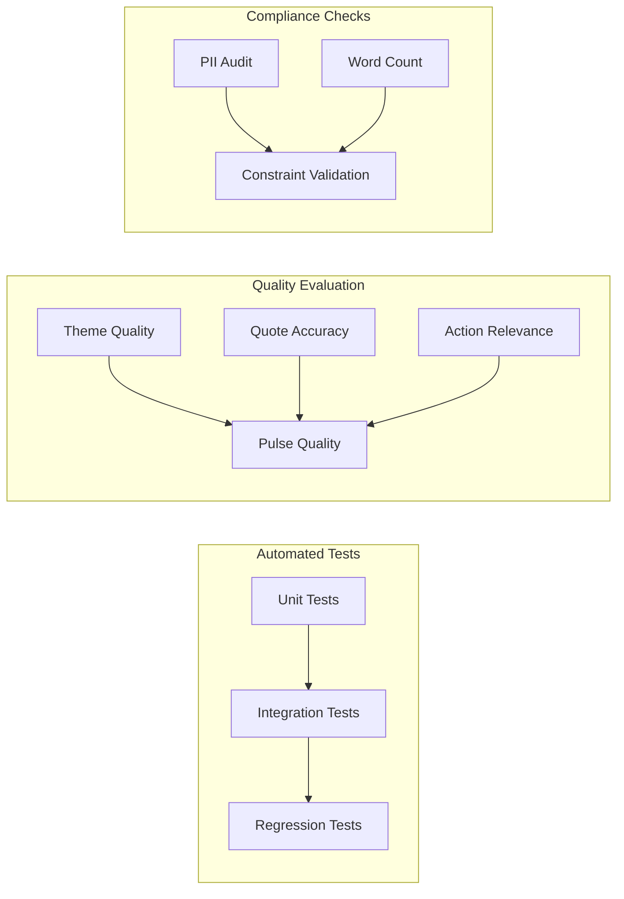

# Evaluation Plan: AI Reviews Summarizer for Noon

> **Reference Documents:**
> - [implementation-plan.md](file:///c:/AI%20reviews%20summarizer/implementation-plan.md)
> - [architecture.md](file:///c:/AI%20reviews%20summarizer/architecture.md)
> - [edge-cases.md](file:///c:/AI%20reviews%20summarizer/edge-cases.md)

---

## 1. Evaluation Overview

This document defines how each phase and component of the AI Reviews Summarizer is evaluated — covering functional correctness, quality metrics, performance benchmarks, and acceptance criteria. Evaluations are structured as **automated tests**, **LLM output quality checks**, and **manual reviews**.



---

## 2. Phase-Wise Evaluation Criteria

### Phase 1: Project Setup & Configuration

| # | Test | Type | Pass Criteria |
| :---: | :--- | :--- | :--- |
| 1.1 | Dependency installation | Automated | `pip install -r requirements.txt` exits with code 0; no missing packages. |
| 1.2 | Config loading | Automated | All required env vars load correctly from `.env`. |
| 1.3 | Missing `.env` handling | Automated | Exits with clear error message when `.env` is absent. |
| 1.4 | Placeholder detection | Automated | Detects `your-key-here` placeholder values and aborts with guidance. |
| 1.5 | Python version check | Automated | Aborts with error on Python < 3.11. |
| 1.6 | Directory structure | Automated | All required directories (`data/raw`, `data/processed`, `data/pulses`) are created on first run. |

```python
# tests/test_config.py
def test_env_loading():
    """All required config values are present and non-empty."""
    assert config.GEMINI_API_KEY is not None
    assert config.GOOGLE_PLAY_APP_ID == "com.noon.buyerapp"
    assert 1 <= config.REVIEW_WEEKS <= 52

def test_missing_env_aborts():
    """Pipeline aborts with clear message when .env is missing."""
    # Remove .env, run main, expect SystemExit with message
```

---

### Phase 2: Review Ingestion

| # | Test | Type | Pass Criteria |
| :---: | :--- | :--- | :--- |
| 2.1 | Live fetch | Integration | `fetch_reviews()` returns ≥1 review from Google Play. |
| 2.2 | Schema validation | Automated | Every review has: `reviewId` (str), `rating` (1–5), `text` (non-empty str), `date` (valid ISO date). |
| 2.3 | Date filtering | Automated | No review has a `date` older than `today - REVIEW_WEEKS * 7`. |
| 2.4 | Output file created | Automated | `data/raw/google_play_reviews.json` exists and is valid JSON. |
| 2.5 | Retry on failure | Automated | Simulated network error triggers 3 retries with exponential backoff. |
| 2.6 | Empty result handling | Automated | Zero reviews triggers window widening + retry; if still empty, abort with clear error. |
| 2.7 | Large volume handling | Automated | >5000 reviews triggers stratified sampling to ≤1000. |

```python
# tests/test_tools.py
def test_fetch_reviews_schema():
    """Each fetched review conforms to the expected schema."""
    reviews = json.load(open("data/raw/google_play_reviews.json"))
    for review in reviews:
        assert "reviewId" in review
        assert isinstance(review["rating"], int)
        assert 1 <= review["rating"] <= 5
        assert len(review["text"].strip()) > 0
        assert datetime.fromisoformat(review["date"])

def test_fetch_reviews_date_window():
    """All reviews fall within the configured time window."""
    cutoff = datetime.now() - timedelta(weeks=config.REVIEW_WEEKS)
    reviews = json.load(open("data/raw/google_play_reviews.json"))
    for review in reviews:
        assert datetime.fromisoformat(review["date"]) >= cutoff
```

---

### Phase 3: Data Processing

| # | Test | Type | Pass Criteria |
| :---: | :--- | :--- | :--- |
| 3.1 | Normalization | Automated | All reviews conform to unified schema (`id`, `source`, `rating`, `title`, `text`, `date`, `language`). |
| 3.2 | Deduplication accuracy | Automated | Known duplicate pairs are removed; unique reviews are preserved. |
| 3.3 | PII stripping — emails | Automated | All email patterns (`user@example.com`) replaced with `[REDACTED]`. |
| 3.4 | PII stripping — phones | Automated | All phone patterns (`+971-50-xxx-xxxx`, `050xxxxxxx`) replaced with `[REDACTED]`. |
| 3.5 | PII stripping — device IDs | Automated | Patterns like `IMEI:xxxx`, `Device ID:xxxx` replaced with `[REDACTED]`. |
| 3.6 | PII stripping — names (LLM) | Semi-auto | LLM-flagged names in test corpus are redacted. |
| 3.7 | Emoji-only filter | Automated | Reviews with <5 alphanumeric chars are excluded. |
| 3.8 | Long review truncation | Automated | Reviews >500 words are truncated with `[truncated]` marker. |
| 3.9 | Output file valid | Automated | `data/processed/cleaned_reviews.json` is valid JSON with ≥10 reviews. |

```python
# tests/test_processing.py

# --- PII Stripping Tests ---
PII_TEST_CASES = [
    ("Contact me at ahmed@gmail.com for details", "Contact me at [REDACTED] for details"),
    ("Call +971501234567 asap", "Call [REDACTED] asap"),
    ("My device ID is IMEI:123456789012345", "My device ID is [REDACTED]"),
    ("Order #ORD-98765 never arrived", "Order [REDACTED] never arrived"),
    ("No PII in this review at all", "No PII in this review at all"),  # unchanged
]

@pytest.mark.parametrize("input_text,expected", PII_TEST_CASES)
def test_pii_stripping(input_text, expected):
    result = pii_stripper.strip(input_text)
    assert result == expected

# --- Deduplication Tests ---
def test_deduplication():
    reviews = [
        {"text": "Great app!", "date": "2026-09-01"},
        {"text": "Great app!", "date": "2026-09-01"},  # duplicate
        {"text": "Great app!", "date": "2026-09-02"},  # different date — keep
        {"text": "Terrible app", "date": "2026-09-01"},  # different text — keep
    ]
    result = deduplicator.deduplicate(reviews)
    assert len(result) == 3

# --- Emoji-Only Filter ---
def test_emoji_only_filter():
    assert normalizer.is_meaningful("👍👍👍") == False
    assert normalizer.is_meaningful("!!!") == False
    assert normalizer.is_meaningful("Great app overall") == True
    assert normalizer.is_meaningful("Bad.") == False  # <5 alphanumeric
```

---

### Phase 4: LLM Theme Clustering & Analysis

| # | Test | Type | Pass Criteria |
| :---: | :--- | :--- | :--- |
| 4.1 | Theme count | Automated | 2 ≤ `len(themes)` ≤ 5. |
| 4.2 | Theme structure | Automated | Each theme has: `theme_name` (str), `description` (str), `review_ids` (list), `review_count` (int), `representative_quote` (str). |
| 4.3 | Top 3 ranking | Automated | Top 3 themes are sorted by `review_count` descending. |
| 4.4 | Quote verbatim check | Automated | Each `representative_quote` exists as an exact substring in the cleaned review corpus. |
| 4.5 | Quote PII check | Automated | No PII detected in any of the 3 selected quotes. |
| 4.6 | Action count | Automated | Exactly 3 action items generated. |
| 4.7 | Action relevance | Manual | Each action is grounded in its theme (not generic boilerplate). |
| 4.8 | Invalid JSON retry | Automated | Simulated malformed LLM output triggers retry; valid JSON produced within 2 retries. |
| 4.9 | Theme distinctness | Manual | No two themes are semantically identical or heavily overlapping. |
| 4.10 | Theme name professionalism | Manual | Theme names are neutral and suitable for executive reporting. |

```python
# tests/test_chains.py

def test_theme_count():
    """Clustering produces 2-5 themes."""
    result = theme_chain.invoke({"reviews": sample_reviews})
    assert 2 <= len(result["themes"]) <= 5

def test_top3_ranking():
    """Top 3 themes are sorted by review count descending."""
    themes = result["themes"][:3]
    counts = [t["review_count"] for t in themes]
    assert counts == sorted(counts, reverse=True)

def test_quotes_are_verbatim():
    """Each selected quote exists in the original review corpus."""
    corpus_texts = [r["text"] for r in cleaned_reviews]
    for theme in result["themes"][:3]:
        quote = theme["representative_quote"]
        assert any(quote in text for text in corpus_texts), \
            f"Quote not found in corpus: '{quote[:50]}...'"

def test_quotes_pii_free():
    """No PII in selected quotes."""
    for theme in result["themes"][:3]:
        quote = theme["representative_quote"]
        assert not pii_stripper.contains_pii(quote), \
            f"PII detected in quote: '{quote[:50]}...'"

def test_action_count():
    """Exactly 3 action items are generated."""
    assert len(result["actions"]) == 3
```

### Theme Quality Scoring Rubric (Manual Evaluation)

For manual evaluation of theme quality, use this rubric on a sample of 5 generated pulses:

| Criterion | Score 1 (Poor) | Score 2 (Fair) | Score 3 (Good) | Score 4 (Excellent) |
| :--- | :--- | :--- | :--- | :--- |
| **Theme Distinctness** | Themes are identical or meaningless | Minor overlap between 2 themes | Themes are mostly distinct | All themes are clearly distinct and non-overlapping |
| **Theme Relevance** | Themes don't reflect actual review content | Themes partially match review content | Themes align well with review content | Themes precisely capture the core user concerns |
| **Quote Representativeness** | Quote is unrelated to its theme | Quote is tangentially related | Quote captures the theme well | Quote is the perfect exemplar of the theme |
| **Action Specificity** | Generic advice ("improve the app") | Somewhat specific but vague | Concrete suggestion with clear direction | Specific, actionable, and directly tied to theme data |
| **Action Feasibility** | Unrealistic or impossible | Possible but costly/complex | Reasonable and practical | Easy to implement with clear ROI |

**Minimum passing score:** Average ≥ 2.5 across all criteria and all 5 samples.

---

### Phase 5: Pulse Note Generation

| # | Test | Type | Pass Criteria |
| :---: | :--- | :--- | :--- |
| 5.1 | Word count | Automated | `len(pulse.split()) ≤ 250` |
| 5.2 | Structure compliance | Automated | Pulse contains exactly 3 theme headings, 3 blockquotes (quotes), 3 action items. |
| 5.3 | Date range present | Automated | Pulse contains start and end dates matching the review window. |
| 5.4 | Average rating present | Automated | Pulse contains `"Average rating: X.X / 5"` with valid float. |
| 5.5 | Total review count | Automated | Pulse mentions the total number of reviews analyzed. |
| 5.6 | Final PII scan | Automated | No PII patterns detected in the entire pulse text. |
| 5.7 | Markdown validity | Automated | Pulse is valid Markdown (parseable without errors). |
| 5.8 | Re-prompting on over-limit | Automated | A 300-word pulse triggers re-prompting; final output is ≤250 words. |
| 5.9 | File saved | Automated | `data/pulses/pulse_YYYY-MM-DD.md` exists with correct content. |

```python
# tests/test_pulse.py

def test_word_count():
    """Pulse is within the 250-word limit."""
    pulse = open("data/pulses/pulse_2026-09-13.md").read()
    word_count = len(pulse.split())
    assert word_count <= 250, f"Pulse has {word_count} words (max 250)"

def test_structure():
    """Pulse contains exactly 3 themes, 3 quotes, 3 actions."""
    pulse = open("data/pulses/pulse_2026-09-13.md").read()
    assert pulse.count("###") == 3, "Expected 3 theme headings"
    assert pulse.count("> \"") == 3, "Expected 3 blockquote quotes"
    assert pulse.count("**Action:**") == 3, "Expected 3 action items"

def test_no_pii_in_pulse():
    """Final pulse contains no PII."""
    pulse = open("data/pulses/pulse_2026-09-13.md").read()
    assert not pii_stripper.contains_pii(pulse), "PII found in final pulse!"

def test_metadata_present():
    """Pulse contains review count, date range, and average rating."""
    pulse = open("data/pulses/pulse_2026-09-13.md").read()
    assert "reviews from" in pulse.lower()
    assert "average rating" in pulse.lower()
    assert re.search(r"\d+\.\d+ / 5", pulse), "Average rating format not found"
```

### Pulse Quality Scoring Rubric (Manual Evaluation)

| Criterion | Score 1 (Poor) | Score 2 (Fair) | Score 3 (Good) | Score 4 (Excellent) |
| :--- | :--- | :--- | :--- | :--- |
| **Readability** | Confusing, hard to scan | Readable but dense | Clear and well-structured | Instantly scannable; leadership can read in <2 min |
| **Informativeness** | No useful insights | Some useful info buried in text | Key insights are present and clear | Immediately highlights what matters and why |
| **Actionability** | No clear next steps | Actions exist but are vague | Actions are concrete and useful | Actions are specific, prioritized, and compelling |
| **Tone** | Informal/unprofessional | Acceptable but inconsistent | Professional and clear | Executive-ready; polished and confident |
| **Completeness** | Missing themes, quotes, or actions | Has all elements but some are weak | All elements present and solid | Perfect: 3 themes, 3 quotes, 3 actions, metadata |

**Minimum passing score:** Average ≥ 3.0 across all criteria.

---

### Phase 6: MCP Delivery (Google Docs + Gmail)

| # | Test | Type | Pass Criteria |
| :---: | :--- | :--- | :--- |
| 6.1 | MCP Docs connection | Integration | MCP Docs server responds to health check / tool listing. |
| 6.2 | Google Doc creation | Integration | A Google Doc is created with correct title and content. |
| 6.3 | Doc URL returned | Integration | A valid, accessible Google Docs URL is returned. |
| 6.4 | Doc content matches pulse | Integration | Google Doc body matches the generated pulse (diff check). |
| 6.5 | MCP Gmail connection | Integration | MCP Gmail server responds to health check / tool listing. |
| 6.6 | Gmail draft creation | Integration | A draft email is created in the user's Gmail. |
| 6.7 | Draft contains Doc link | Integration | Email body contains the Google Doc URL. |
| 6.8 | Draft subject format | Integration | Subject follows `"Weekly Noon App Pulse — {date}"` pattern. |
| 6.9 | Fallback on MCP failure | Automated | When MCP is unreachable, pulse is saved locally and error is logged. |
| 6.10 | Retry behavior | Automated | 3 retries with exponential backoff before fallback. |
| 6.11 | Independent delivery | Automated | Docs failure doesn't block Gmail draft (and vice versa). |

```python
# tests/test_delivery.py

def test_mcp_docs_fallback(mock_mcp_server_down):
    """When MCP Docs is unreachable, pulse is saved locally."""
    result = publish_to_docs("Test pulse content")
    assert "saved locally" in result.lower()
    assert os.path.exists("data/pulses/pulse_2026-09-13.md")

def test_mcp_gmail_fallback(mock_mcp_server_down):
    """When MCP Gmail is unreachable, email content is saved locally."""
    result = draft_email("Test pulse", "https://docs.google.com/xxx")
    assert "saved locally" in result.lower()

def test_independent_delivery(mock_docs_down_gmail_up):
    """Docs failure doesn't prevent Gmail draft creation."""
    docs_result = publish_to_docs("Test pulse")
    gmail_result = draft_email("Test pulse", "N/A")
    assert "saved locally" in docs_result.lower()  # Docs failed
    assert "draft created" in gmail_result.lower()  # Gmail succeeded
```

---

### Phase 7: LangChain Agent Orchestration

| # | Test | Type | Pass Criteria |
| :---: | :--- | :--- | :--- |
| 7.1 | End-to-end run | Integration | `python src/main.py` completes without errors. |
| 7.2 | Tool execution order | Automated | Tools are called in sequence: fetch → process → cluster → pulse → docs → email. |
| 7.3 | All output artifacts | Automated | After run: `raw/`, `processed/`, `pulses/` all contain expected files. |
| 7.4 | Max iterations guard | Automated | Agent stops within 10 iterations. |
| 7.5 | Max time guard | Automated | Agent stops within 5 minutes. |
| 7.6 | Error recovery | Automated | Agent recovers from a single tool failure (retries or reports). |
| 7.7 | Final output | Automated | Agent's final message contains Google Doc URL and Gmail draft confirmation. |
| 7.8 | Idempotency | Automated | Running twice doesn't create duplicate data (second run overwrites or skips). |

```python
# tests/test_agent.py

def test_end_to_end():
    """Full pipeline runs without errors."""
    result = agent_executor.invoke({"input": "Generate this week's Noon app review pulse."})
    assert "output" in result
    assert "error" not in result["output"].lower()

def test_tool_order(caplog):
    """Tools are invoked in the correct sequence."""
    agent_executor.invoke({"input": "Generate this week's Noon app review pulse."})
    tool_calls = [r for r in caplog.records if "tool" in r.getMessage().lower()]
    expected_order = ["fetch_reviews", "process_reviews", "cluster_themes",
                      "generate_pulse", "publish_to_docs", "draft_email"]
    actual_order = [extract_tool_name(r) for r in tool_calls]
    assert actual_order == expected_order

def test_max_iterations():
    """Agent doesn't exceed max_iterations."""
    with patch("tools.fetch_reviews", side_effect=Exception("fail")):
        result = agent_executor.invoke({"input": "Generate pulse."})
        # Should stop within 10 iterations, not loop forever
```

---

### Phase 8: Testing, Polish & Documentation

| # | Test | Type | Pass Criteria |
| :---: | :--- | :--- | :--- |
| 8.1 | All unit tests pass | Automated | `pytest tests/ -v` exits with code 0. |
| 8.2 | Test coverage | Automated | ≥80% line coverage across `src/`. |
| 8.3 | PII audit | Manual | 10 sample pulses reviewed — zero PII found. |
| 8.4 | README completeness | Manual | README contains: setup, usage, architecture link, example output, troubleshooting. |
| 8.5 | `.gitignore` correct | Automated | `.env`, `data/`, `__pycache__/` are excluded from git tracking. |
| 8.6 | Logging quality | Manual | All key steps logged with appropriate levels (INFO/WARNING/ERROR). |

---

## 3. Automated Test Suite Summary

### Test Command
```bash
# Run all tests
pytest tests/ -v --tb=short

# Run with coverage
pytest tests/ -v --cov=src --cov-report=term-missing

# Run specific test category
pytest tests/test_processing.py -v
pytest tests/test_chains.py -v
pytest tests/test_delivery.py -v
```

### Test File Map

| Test File | Module Tested | # Tests | Type |
| :--- | :--- | :---: | :--- |
| `tests/test_config.py` | `src/config.py` | 5 | Unit |
| `tests/test_tools.py` | `src/tools/*.py` | 10 | Unit + Integration |
| `tests/test_processing.py` | `src/processing/*.py` | 12 | Unit |
| `tests/test_chains.py` | `src/chains/*.py` | 8 | Unit (mocked LLM) |
| `tests/test_pulse.py` | `src/tools/generate_pulse.py` | 7 | Unit |
| `tests/test_delivery.py` | `src/delivery/*.py` | 8 | Unit (mocked MCP) |
| `tests/test_agent.py` | `src/agent.py` | 6 | Integration |
| **Total** | | **~56** | |

### Coverage Targets

| Module | Target | Critical Paths |
| :--- | :---: | :--- |
| `src/processing/` | ≥90% | PII stripping, deduplication |
| `src/tools/` | ≥85% | All 6 LangChain tools |
| `src/chains/` | ≥80% | Theme chain, pulse chain |
| `src/delivery/` | ≥80% | MCP clients, fallback logic |
| `src/config.py` | ≥95% | Validation, defaults |
| **Overall** | **≥80%** | |

---

## 4. LLM Output Quality Evaluation

Since much of the system relies on LLM-generated content, dedicated quality evaluation is critical.

### 4.1 Evaluation Dataset
Create a golden dataset of **20 manually curated review sets** with expected outputs:

| Dataset | Reviews | Expected Themes | Expected Actions |
| :--- | :---: | :--- | :--- |
| `eval_set_01.json` | 50 | Delivery, Payments, App Bugs | Fix payment timeout, Improve tracking, Fix crash on login |
| `eval_set_02.json` | 100 | Customer Support, Pricing | Reduce response time, Clarify coupon terms |
| ... | ... | ... | ... |

### 4.2 Quality Metrics

#### Theme Accuracy
```
Theme Precision = (Correctly identified themes) / (Total themes returned)
Theme Recall    = (Correctly identified themes) / (Total expected themes)
Theme F1        = 2 * (Precision * Recall) / (Precision + Recall)
```
**Target: F1 ≥ 0.75**

#### Quote Verbatim Rate
```
Verbatim Rate = (Quotes exactly matching source) / (Total quotes selected)
```
**Target: 100%** (non-negotiable per requirements)

#### Action Relevance Score
Manual scoring on a 1–4 scale (see rubric in Phase 4). Average across all samples.
**Target: Average ≥ 3.0**

#### Word Count Compliance
```
Compliance Rate = (Pulses ≤ 250 words) / (Total pulses generated)
```
**Target: 100%** after re-prompting

#### PII Leak Rate
```
PII Leak Rate = (Pulses containing PII) / (Total pulses generated)
```
**Target: 0%** (non-negotiable)

### 4.3 Automated LLM Evaluation (LLM-as-Judge)

Use a separate LLM call to evaluate the quality of generated output:

```python
evaluation_prompt = """
You are evaluating the quality of a weekly review pulse for an app.

PULSE:
{pulse}

ORIGINAL REVIEWS (sample):
{sample_reviews}

Rate the following on a scale of 1-4:
1. Theme Distinctness: Are the 3 themes clearly different?
2. Quote Accuracy: Do the quotes appear to be real user words?
3. Action Specificity: Are the actions concrete and useful?
4. Overall Readability: Is it scannable in under 2 minutes?
5. Professional Tone: Suitable for executive audience?

Output JSON: {"theme_distinctness": N, "quote_accuracy": N, "action_specificity": N, "readability": N, "tone": N}
"""
```

**Run this on every generated pulse.** Log scores. Alert if any score < 2.

---

## 5. Performance Benchmarks

| Metric | Target | Measurement Method |
| :--- | :---: | :--- |
| **Review fetch time** | < 60 seconds | `time.time()` around `fetch_reviews()` |
| **Processing time** (normalize + dedup + PII) | < 30 seconds for 1000 reviews | `time.time()` around `process_reviews()` |
| **LLM clustering time** | < 45 seconds | `time.time()` around `cluster_themes()` |
| **Pulse generation time** | < 15 seconds | `time.time()` around `generate_pulse()` |
| **MCP Doc creation** | < 10 seconds | `time.time()` around `publish_to_docs()` |
| **MCP Gmail draft** | < 10 seconds | `time.time()` around `draft_email()` |
| **Total pipeline time** | < 3 minutes | `time.time()` around full `agent_executor.invoke()` |
| **Memory usage** | < 512 MB peak | `tracemalloc` profiling |
| **LLM API calls** | ≤ 5 per run | Count API calls in LangSmith trace |

```python
# tests/test_performance.py

import time

def test_pipeline_performance():
    """Full pipeline completes within 3 minutes."""
    start = time.time()
    agent_executor.invoke({"input": "Generate this week's pulse."})
    elapsed = time.time() - start
    assert elapsed < 180, f"Pipeline took {elapsed:.0f}s (max 180s)"

def test_processing_performance():
    """Processing 1000 reviews completes within 30 seconds."""
    start = time.time()
    process_reviews()
    elapsed = time.time() - start
    assert elapsed < 30, f"Processing took {elapsed:.1f}s (max 30s)"
```

---

## 6. Compliance & Constraint Validation

### 6.1 Constraint Checklist

Run this checklist against every generated pulse:

| # | Constraint | Check | Tool |
| :---: | :--- | :--- | :--- |
| C1 | Public reviews only | No scraping behind logins | Code review |
| C2 | ≤5 themes for clustering | `len(themes) <= 5` | Automated |
| C3 | Top 3 themes in pulse | `pulse.count("###") == 3` | Automated |
| C4 | 3 user quotes | `pulse.count("> \"") == 3` | Automated |
| C5 | 3 action ideas | `pulse.count("Action:") == 3` | Automated |
| C6 | ≤250 words | `len(pulse.split()) <= 250` | Automated |
| C7 | No PII anywhere | PII regex + LLM scan | Automated |
| C8 | Verbatim quotes only | Cross-ref against corpus | Automated |
| C9 | Google Doc created via MCP | MCP tool call log | Automated |
| C10 | Gmail draft created via MCP | MCP tool call log | Automated |

```python
# tests/test_compliance.py

def test_all_constraints(generated_pulse, cleaned_reviews):
    """Verify all problem statement constraints are met."""
    # C2: ≤5 themes
    assert len(themes) <= 5

    # C3: Top 3 in pulse
    assert generated_pulse.count("###") == 3

    # C4: 3 quotes
    assert generated_pulse.count("> \"") == 3

    # C5: 3 actions
    assert generated_pulse.lower().count("action:") == 3

    # C6: ≤250 words
    assert len(generated_pulse.split()) <= 250

    # C7: No PII
    assert not pii_stripper.contains_pii(generated_pulse)

    # C8: Verbatim quotes
    quotes = extract_quotes(generated_pulse)
    corpus = [r["text"] for r in cleaned_reviews]
    for quote in quotes:
        assert any(quote in text for text in corpus)
```

---

## 7. Regression Testing Strategy

### When to Run Regression Tests

| Trigger | Tests to Run |
| :--- | :--- |
| Any code change to `src/processing/` | `test_processing.py` |
| Any prompt template change | `test_chains.py` + `test_compliance.py` |
| LLM model version change | Full test suite + manual quality review |
| `google-play-scraper` version update | `test_tools.py` (ingestion tests) |
| MCP server update | `test_delivery.py` |
| Any change | `test_compliance.py` (constraint validation) |

### CI/CD Integration (Future)

```yaml
# .github/workflows/test.yml
name: Test Suite
on: [push, pull_request]
jobs:
  test:
    runs-on: ubuntu-latest
    steps:
      - uses: actions/checkout@v4
      - uses: actions/setup-python@v5
        with:
          python-version: '3.11'
      - run: pip install -r requirements.txt
      - run: pytest tests/ -v --cov=src --cov-report=term-missing
        env:
          GEMINI_API_KEY: ${{ secrets.GEMINI_API_KEY }}
```

---

## 8. Manual Evaluation Checklist

For each weekly pulse delivery, a human reviewer should complete this checklist:

### Pre-Delivery Review

- [ ] **Themes make sense:** Do the 3 themes reflect real user concerns for Noon?
- [ ] **Quotes are real:** Do the quotes sound like actual user feedback (not AI-generated)?
- [ ] **Actions are useful:** Would a PM actually consider implementing these suggestions?
- [ ] **No PII:** Are there any names, emails, phone numbers, or addresses visible?
- [ ] **Professional tone:** Would you send this to your VP/C-suite as-is?
- [ ] **Under 250 words:** Is the note scannable in under 2 minutes?

### Post-Delivery Verification

- [ ] **Google Doc accessible:** Can you open the Google Doc URL?
- [ ] **Doc content matches:** Does the Google Doc match the generated pulse exactly?
- [ ] **Gmail draft present:** Is the draft visible in Gmail Drafts?
- [ ] **Draft sendable:** Can the draft be sent without modifications?

---

## 9. Evaluation Summary Matrix

| Phase | Auto Tests | Manual Checks | Quality Metrics | Performance |
| :---: | :---: | :---: | :---: | :---: |
| 1 — Setup | 6 | — | — | — |
| 2 — Ingestion | 7 | — | — | < 60s |
| 3 — Processing | 9 | — | — | < 30s |
| 4 — Clustering | 10 | Theme rubric (5 samples) | F1 ≥ 0.75, Verbatim 100% | < 45s |
| 5 — Pulse | 9 | Pulse rubric (5 samples) | Words ≤ 250, PII 0% | < 15s |
| 6 — Delivery | 11 | Post-delivery check | — | < 20s |
| 7 — Agent | 8 | — | — | < 3 min total |
| 8 — Polish | 6 | README, PII audit | Coverage ≥ 80% | — |
| **Total** | **~66** | **~15** | **5 metrics** | **6 benchmarks** |
