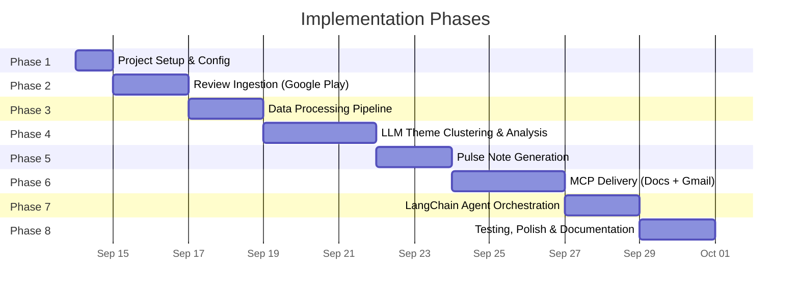
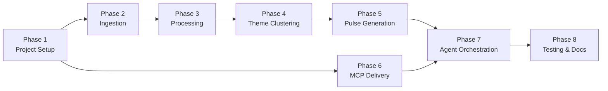

# Implementation Plan: AI Reviews Summarizer for Noon

> **Reference Documents:**
> - [problemStatement.md](file:///c:/AI%20reviews%20summarizer/problemStatement.md)
> - [architecture.md](file:///c:/AI%20reviews%20summarizer/architecture.md)

---

## Phase Overview



| Phase | Name | Est. Duration | Key Deliverable |
| :---: | :--- | :---: | :--- |
| 1 | Project Setup & Configuration | 1 day | Runnable skeleton with dependencies installed |
| 2 | Review Ingestion | 2 days | `fetch_reviews` tool fetching live Google Play data |
| 3 | Data Processing Pipeline | 2 days | Clean, deduplicated, PII-stripped review corpus |
| 4 | LLM Theme Clustering & Analysis | 3 days | ≤5 themes, top 3 ranked, 3 quotes, 3 actions |
| 5 | Pulse Note Generation | 2 days | Formatted ≤250-word weekly pulse document |
| 6 | MCP Delivery (Google Docs + Gmail) | 3 days | Pulse published to Google Doc + Gmail draft created |
| 7 | LangChain Agent Orchestration | 2 days | End-to-end agent running the full pipeline autonomously |
| 8 | Testing, Polish & Documentation | 2 days | Tests passing, README complete, demo-ready |

**Total Estimated Duration: ~17 days**

---

## Phase 1: Project Setup & Configuration

### Objective
Set up the project skeleton, install all dependencies, configure environment variables, and verify the dev environment works end-to-end.

### Tasks

#### 1.1 Initialize Project Structure
Create the directory layout as defined in [architecture.md § Project Structure](file:///c:/AI%20reviews%20summarizer/architecture.md#L290-L349):

```
AI reviews summarizer/
├── src/
│   ├── main.py
│   ├── agent.py
│   ├── config.py
│   ├── tools/
│   │   └── __init__.py
│   ├── chains/
│   │   └── __init__.py
│   ├── prompts/
│   │   └── __init__.py
│   ├── processing/
│   │   └── __init__.py
│   └── delivery/
│       └── __init__.py
├── data/
│   ├── raw/
│   ├── processed/
│   └── pulses/
├── tests/
├── .env.example
├── .gitignore
└── requirements.txt
```

#### 1.2 Install Dependencies
Create `requirements.txt` with all required packages:

```text
# LangChain
langchain>=0.3.0
langchain-core>=0.3.0
langchain-google-genai>=2.0.0
langgraph>=0.2.0

# Review Scraping
google-play-scraper>=1.2.0

# Data Processing
python-dotenv>=1.0.0
jinja2>=3.1.0

# MCP
mcp>=1.0.0

# Testing
pytest>=8.0.0
pytest-asyncio>=0.23.0
```

#### 1.3 Environment Configuration
Create `src/config.py` to load `.env` variables:
- `GEMINI_API_KEY`
- `GOOGLE_PLAY_APP_ID` → `com.noon.buyerapp`
- `REVIEW_WEEKS` → `10`
- `MCP_DOCS_SERVER_URL`
- `MCP_GMAIL_SERVER_URL`
- `PULSE_DOC_TITLE`, `EMAIL_RECIPIENT`, `EMAIL_SUBJECT`
- Optional: `LANGCHAIN_TRACING_V2`, `LANGCHAIN_API_KEY`

#### 1.4 Create `.env.example`
Template file with placeholder values (no real keys committed).

### Exit Criteria
- [ ] `pip install -r requirements.txt` succeeds without errors.
- [ ] `python src/main.py` runs and prints a "Setup OK" message.
- [ ] `.env` loaded successfully with all config values accessible.

---

## Phase 2: Review Ingestion (Google Play)

### Objective
Build the `fetch_reviews` LangChain tool that scrapes public Google Play reviews for the Noon Buyer App and saves raw data locally.

### Tasks

#### 2.1 Create `src/tools/fetch_reviews.py`
- Use `google-play-scraper` Python package.
- App ID: `com.noon.buyerapp`.
- Fetch reviews from the last 8–12 weeks (configurable via `REVIEW_WEEKS`).
- Capture fields: `reviewId`, `rating`, `title`, `text`, `date`, `source` (hardcoded to `"google_play"`).
- Sort by newest first; paginate through results.
- Save raw output to `data/raw/google_play_reviews.json`.

#### 2.2 Wrap as LangChain Tool
```python
from langchain_core.tools import tool

@tool
def fetch_reviews() -> str:
    """Fetch recent Google Play reviews for the Noon Buyer App."""
    # ... scraping logic ...
    return f"Fetched {count} reviews and saved to data/raw/google_play_reviews.json"
```

#### 2.3 Date Filtering Logic
- Calculate the cutoff date: `today - REVIEW_WEEKS * 7` days.
- Filter out any review with `date < cutoff`.
- Log count of total vs. filtered reviews.

#### 2.4 Error Handling
- Implement exponential backoff (max 3 retries) if the scraper is rate-limited.
- If zero reviews returned, log a warning and widen window by 2 weeks.

### Exit Criteria
- [ ] Running `fetch_reviews()` fetches live reviews and saves valid JSON.
- [ ] Output JSON contains expected fields: `reviewId`, `rating`, `title`, `text`, `date`, `source`.
- [ ] Date filtering correctly limits to the configured time window.
- [ ] Retry logic works when network errors are simulated.

---

## Phase 3: Data Processing Pipeline

### Objective
Build the processing pipeline that normalizes, deduplicates, and strips PII from raw reviews.

### Tasks

#### 3.1 Create `src/processing/normalizer.py`
- Load raw JSON from `data/raw/google_play_reviews.json`.
- Map fields to the unified schema:
  ```json
  {
    "id": "hashed(reviewId)",
    "source": "google_play",
    "rating": 1-5,
    "title": "string | null",
    "text": "string",
    "date": "ISO 8601",
    "language": "en"
  }
  ```
- Generate deterministic `id` by hashing `reviewId` (SHA-256 truncated).

#### 3.2 Create `src/processing/deduplicator.py`
- Deduplicate reviews by exact `text` + `date` match.
- Log count of duplicates removed.

#### 3.3 Create `src/processing/pii_stripper.py`
**Layer 1 — Regex:**
- Strip email addresses: `\b[\w.-]+@[\w.-]+\.\w+\b`
- Strip phone numbers: common international patterns.
- Strip device IDs, order IDs, and similar identifiers.
- Replace matched PII with `[REDACTED]`.

**Layer 2 — LLM-assisted (optional enhancement):**
- Send flagged reviews through the LLM with a prompt asking to identify and redact any remaining PII (names, addresses, etc.).

#### 3.4 Create `src/tools/process_reviews.py`
Wrap the full pipeline as a LangChain tool:
```python
@tool
def process_reviews() -> str:
    """Clean, normalize, deduplicate, and strip PII from raw reviews."""
    # normalize → deduplicate → strip PII
    # Save to data/processed/cleaned_reviews.json
    return f"Processed {count} reviews (removed {dupes} duplicates, redacted {pii_count} PII instances)"
```

#### 3.5 Add Date Filtering
- Re-validate date window during processing (defense-in-depth).

### Exit Criteria
- [ ] Normalized JSON conforms to the unified schema.
- [ ] Duplicates are correctly identified and removed.
- [ ] PII regex catches emails, phone numbers, and device IDs in test data.
- [ ] `data/processed/cleaned_reviews.json` is created with clean data.
- [ ] No PII present in the processed output (verified by manual spot-check).

---

## Phase 4: LLM Theme Clustering & Analysis

### Objective
Use LangChain chains with Gemini to cluster reviews into ≤5 themes, rank the top 3, select 3 quotes, and generate 3 action ideas.

### Tasks

#### 4.1 Create `src/prompts/clustering_prompt.py`
Design a `ChatPromptTemplate` for theme clustering:
- System message: Define the task (cluster app reviews into ≤5 themes).
- Human message: Inject the cleaned review corpus.
- Output format: Structured JSON with theme names, descriptions, assigned review IDs, and review counts.

```python
clustering_prompt = ChatPromptTemplate.from_messages([
    ("system", """You are an expert product analyst. Given a corpus of app reviews,
    identify up to 5 recurring themes. For each theme provide:
    - theme_name: short label
    - description: 1-sentence summary
    - review_ids: list of review IDs belonging to this theme
    - review_count: number of reviews
    - representative_quote: the best verbatim quote from this theme
    Output valid JSON only."""),
    ("human", "Reviews:\n{reviews}")
])
```

#### 4.2 Create `src/prompts/action_prompt.py`
Prompt for generating 3 actionable recommendations from the top 3 themes:
- Input: Top 3 themes with their descriptions and sample reviews.
- Output: 3 concrete, specific action items.

#### 4.3 Create `src/chains/theme_chain.py`
Compose the LangChain chain:
```python
from langchain_core.output_parsers import JsonOutputParser

theme_chain = clustering_prompt | llm | JsonOutputParser()
```

Pipeline:
1. **Cluster:** `clustering_prompt | llm | JsonOutputParser()` → 5 themes with assignments.
2. **Rank:** Sort themes by `review_count` descending → select top 3.
3. **Quote Select:** Extract `representative_quote` from each top theme.
4. **Actions:** `action_prompt | llm | JsonOutputParser()` → 3 action ideas.

#### 4.4 Create `src/tools/cluster_themes.py`
Wrap as a LangChain tool:
```python
@tool
def cluster_themes() -> str:
    """Cluster processed reviews into themes and extract insights."""
    # Load cleaned reviews
    # Run theme_chain
    # Return top 3 themes + quotes + actions as JSON
```

#### 4.5 Handle LLM Edge Cases
- Validate that the LLM output is valid JSON (retry up to 2 times if not).
- Accept fewer than 5 themes (minimum 2 required).
- Ensure quotes are verbatim (cross-check against original review text).
- Verify no PII in quotes (re-run PII stripper on selected quotes).

### Exit Criteria
- [ ] Theme chain produces valid JSON with ≤5 themes.
- [ ] Top 3 themes are correctly ranked by volume.
- [ ] 3 verbatim quotes are selected (one per top theme) and verified against source.
- [ ] 3 action ideas are concrete, specific, and grounded in the theme data.
- [ ] Retry logic handles malformed LLM output gracefully.

---

## Phase 5: Pulse Note Generation

### Objective
Assemble the final weekly pulse note (≤250 words) from themes, quotes, and actions.

### Tasks

#### 5.1 Create `src/prompts/pulse_prompt.py`
Prompt template for assembling the pulse note:
- Input: Top 3 themes (with counts), 3 quotes, 3 actions, date range, total review count, average rating.
- Output: Formatted markdown document ≤250 words.
- Enforce the structure defined in [architecture.md § Pulse Structure](file:///c:/AI%20reviews%20summarizer/architecture.md#L169-L190).

#### 5.2 Create `src/chains/pulse_chain.py`
```python
from langchain_core.output_parsers import StrOutputParser

pulse_chain = pulse_prompt | llm | StrOutputParser()
```

#### 5.3 Create `src/tools/generate_pulse.py`
LangChain tool that:
1. Loads the theme analysis output (from Phase 4).
2. Calculates metadata: total review count, date range, average rating.
3. Runs the pulse chain.
4. **Validates word count** — if >250 words, re-prompts with stricter constraints.
5. **Final PII scan** — runs regex PII check on the generated note.
6. Saves the pulse to `data/pulses/pulse_YYYY-MM-DD.md`.

#### 5.4 Word Count Enforcement
```python
def enforce_word_limit(pulse_text: str, max_words: int = 250) -> str:
    word_count = len(pulse_text.split())
    if word_count > max_words:
        # Re-prompt with explicit instruction to condense
        ...
    return pulse_text
```

### Exit Criteria
- [ ] Generated pulse follows the defined markdown structure exactly.
- [ ] Word count is ≤250 words.
- [ ] Contains exactly 3 themes, 3 quotes, 3 actions.
- [ ] No PII in the final output.
- [ ] Pulse file saved to `data/pulses/` with date-stamped filename.

---

## Phase 6: MCP Delivery (Google Docs + Gmail)

### Objective
Integrate with Google Docs and Gmail via MCP servers to publish the pulse and create a draft email.

### Tasks

#### 6.1 MCP Server Setup
- Identify and configure MCP servers for Google Docs and Gmail.
- Verify MCP servers are accessible at the configured URLs.
- Test authentication flow (handled internally by MCP servers).

#### 6.2 Create `src/delivery/mcp_docs.py`
MCP client for Google Docs:
```python
async def create_or_update_doc(pulse_content: str, title: str) -> str:
    """Create a new Google Doc or update existing with the pulse content.
    Returns the shareable document URL."""
    # Connect to MCP Docs server
    # Call docs.create or docs.update tool
    # Return document URL
```

#### 6.3 Create `src/tools/publish_doc.py`
LangChain tool wrapping the MCP Docs client:
```python
@tool
def publish_to_docs(pulse_content: str) -> str:
    """Publish the weekly pulse to Google Docs via MCP."""
    url = create_or_update_doc(pulse_content, config.PULSE_DOC_TITLE)
    return f"Pulse published to Google Docs: {url}"
```

#### 6.4 Create `src/delivery/mcp_gmail.py`
MCP client for Gmail:
```python
async def create_draft(subject: str, body: str, to: str) -> str:
    """Create a Gmail draft with the pulse content.
    Returns confirmation message."""
    # Connect to MCP Gmail server
    # Call gmail.create_draft tool
    # Return draft ID / confirmation
```

#### 6.5 Create `src/tools/draft_email.py`
LangChain tool wrapping the MCP Gmail client:
```python
@tool
def draft_email(pulse_content: str, doc_url: str) -> str:
    """Create a Gmail draft containing the pulse and a link to the Google Doc."""
    subject = config.EMAIL_SUBJECT.format(date=today)
    body = f"{pulse_content}\n\n📄 Full document: {doc_url}"
    create_draft(subject, body, config.EMAIL_RECIPIENT)
    return f"Gmail draft created for {config.EMAIL_RECIPIENT}"
```

#### 6.6 Fallback Handling
- If MCP server is unreachable: retry 3 times with exponential backoff.
- If Google Doc creation fails: save pulse as local markdown file.
- If Gmail draft fails: save email body locally and log error.

### Exit Criteria
- [ ] MCP Docs server is connected and authenticated.
- [ ] Pulse is successfully created as a Google Doc with correct formatting.
- [ ] Document URL is returned and valid.
- [ ] MCP Gmail server is connected and authenticated.
- [ ] Gmail draft is created with the pulse content and Doc link.
- [ ] Fallback saves local files when MCP servers are unavailable.

---

## Phase 7: LangChain Agent Orchestration

### Objective
Wire all tools and chains into a single LangChain agent that executes the full pipeline autonomously.

### Tasks

#### 7.1 Create `src/agent.py`
Define the LangChain agent:
```python
from langchain_google_genai import ChatGoogleGenerativeAI
from langchain.agents import AgentExecutor, create_react_agent
from src.tools import (
    fetch_reviews, process_reviews, cluster_themes,
    generate_pulse, publish_to_docs, draft_email
)

llm = ChatGoogleGenerativeAI(model="gemini-2.0-flash")

tools = [
    fetch_reviews,
    process_reviews,
    cluster_themes,
    generate_pulse,
    publish_to_docs,
    draft_email,
]

agent = create_react_agent(llm, tools, agent_prompt)
agent_executor = AgentExecutor(
    agent=agent,
    tools=tools,
    verbose=True,
    max_iterations=10,
    handle_parsing_errors=True,
)
```

#### 7.2 Design Agent System Prompt
Create the system prompt that instructs the agent on the correct execution order:
```
You are a Review Pulse Agent for the Noon app. Execute these steps in order:
1. Fetch Google Play reviews using fetch_reviews
2. Process and clean reviews using process_reviews
3. Cluster into themes and extract insights using cluster_themes
4. Generate the weekly pulse note using generate_pulse
5. Publish to Google Docs using publish_to_docs
6. Create a Gmail draft using draft_email
Report the final status with the Google Doc URL.
```

#### 7.3 Create `src/main.py`
Entry point:
```python
def main():
    load_dotenv()
    result = agent_executor.invoke({
        "input": "Generate this week's Noon app review pulse."
    })
    print(result["output"])

if __name__ == "__main__":
    main()
```

#### 7.4 State Management
- Pass data between tools via local file system (JSON files in `data/`).
- Each tool reads its input from the previous tool's output file.
- Agent tracks completion status of each step.

#### 7.5 End-to-End Integration Test
Run the full pipeline:
```bash
python src/main.py
```
Verify:
1. Reviews fetched → `data/raw/google_play_reviews.json`
2. Reviews processed → `data/processed/cleaned_reviews.json`
3. Themes clustered → themes JSON in agent memory
4. Pulse generated → `data/pulses/pulse_YYYY-MM-DD.md`
5. Google Doc created → URL returned
6. Gmail draft created → confirmation returned

### Exit Criteria
- [ ] Agent runs the full pipeline without manual intervention.
- [ ] All 6 tools execute in the correct order.
- [ ] Final output includes Google Doc URL and Gmail draft confirmation.
- [ ] Agent handles errors gracefully (retries, fallbacks).
- [ ] `python src/main.py` completes successfully end-to-end.

---

## Phase 8: Testing, Polish & Documentation

### Objective
Ensure code quality, add tests, write documentation, and prepare for deployment.

### Tasks

#### 8.1 Unit Tests

| Test File | What It Tests |
| :--- | :--- |
| `tests/test_tools.py` | Each LangChain tool in isolation (fetch, process, cluster, pulse, publish, draft) |
| `tests/test_chains.py` | Theme chain and pulse chain with mocked LLM responses |
| `tests/test_processing.py` | Normalizer, deduplicator, PII stripper with edge cases |
| `tests/test_pulse.py` | Word count enforcement, structure validation, PII final scan |
| `tests/test_delivery.py` | MCP client with mocked server responses, fallback behavior |

#### 8.2 Integration Test
- End-to-end test with real Google Play data and real LLM calls.
- Verify output quality: themes make sense, quotes are verbatim, actions are actionable.

#### 8.3 PII Audit
- Run PII stripper on the final pulse output.
- Manually review a sample of 10 generated pulses for PII leakage.
- Document the PII patterns covered and any gaps.

#### 8.4 Create `README.md`
Contents:
- Project overview (link to `problemStatement.md`).
- Architecture summary (link to `architecture.md`).
- Setup instructions (prerequisites, install, `.env` config).
- Usage: `python src/main.py`.
- Example output (sample pulse).
- Troubleshooting (common errors, MCP server issues).

#### 8.5 Create `.gitignore`
```
.env
data/raw/
data/processed/
data/pulses/
__pycache__/
*.pyc
.pytest_cache/
```

#### 8.6 Final Polish
- Add logging throughout (Python `logging` module).
- Add CLI arguments (optional): `--dry-run`, `--weeks N`, `--skip-delivery`.
- Review all prompt templates for clarity and robustness.
- Ensure all error messages are actionable.

### Exit Criteria
- [ ] All unit tests pass (`pytest tests/`).
- [ ] Integration test completes successfully with live data.
- [ ] PII audit passes — no PII found in generated output.
- [ ] `README.md` is complete and accurate.
- [ ] Code is clean, well-documented, and ready for demo.

---

## Dependency Graph



> [!NOTE]
> **Phase 6 (MCP Delivery)** can be developed in parallel with Phases 2–5, since it only depends on Phase 1 for project setup. This can shorten the overall timeline.

---

## Risk Register

| Risk | Likelihood | Impact | Mitigation |
| :--- | :---: | :---: | :--- |
| `google-play-scraper` rate-limited or blocked | Medium | High | Exponential backoff; cache raw reviews locally; consider RSS fallback. |
| LLM produces inconsistent theme clusters | Medium | Medium | Strong prompt engineering; output validation; retry with corrections. |
| MCP servers unavailable or poorly documented | Medium | High | Build local fallback (save to file); test MCP connectivity early in Phase 6. |
| PII leaks through in quotes | Low | High | Two-layer PII stripping (regex + LLM); final scan before delivery. |
| Pulse exceeds 250-word limit | Low | Low | Automated word count check with re-prompting if exceeded. |
| Gemini API quota exhaustion | Low | Medium | Batch reviews to minimize API calls; cache LLM responses during development. |

---

## Success Criteria (Definition of Done)

The project is complete when:

- [x] Google Play reviews for `com.noon.buyerapp` are fetched (8–12 weeks).
- [x] Reviews are cleaned, deduplicated, and PII-stripped.
- [x] Reviews are clustered into ≤5 themes with top 3 ranked.
- [x] A ≤250-word pulse note is generated with 3 themes, 3 quotes, 3 actions.
- [x] The pulse is published to a Google Doc via MCP.
- [x] A Gmail draft is created with the pulse content via MCP.
- [x] The full pipeline runs autonomously via a LangChain agent.
- [x] No PII is present in any output artifact.
- [x] Tests pass and documentation is complete.
